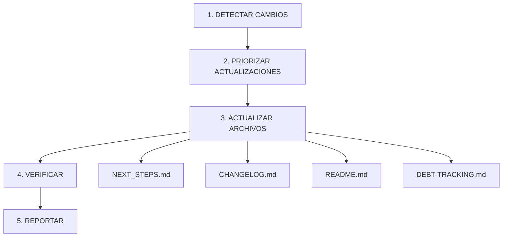

# Workflow de Sincronización Completa

## Objetivo

Coordinar la actualización de todos los archivos de documentación crítica en el orden correcto, verificando consistencia y generando un reporte final.

---

## Flujo Principal



---

## Paso 1: Detectar Cambios

### 1.1 Ver TaskList

```yaml
Action: TaskList
Filter: status == "completed" OR status == "in_progress"

Output: Lista de tareas completadas recientemente
Example:
  - task-123: "Implement document-sync skill" (completed)
  - task-456: "Add OAuth2 support" (completed)
```

### 1.2 Analizar Commits Recientes

```bash
git log --oneline -10 --pretty=format:"%h|%s|%ad" --date=short
```

```yaml
Output:
  abc1234|feat: add document-sync skill|2025-01-23
  def5678|fix: correct metrics calculation|2025-01-23
  ghi9012|docs: update README with new skills|2025-01-22

Categorizar:
  - feat: → agregados de features
  - fix: → correcciones de bugs
  - docs: → cambios en documentación
  - refactor: → cambios en estructura
  - security: → issues de seguridad
```

### 1.3 Verificar Archivos Monitoreados

```yaml
Files to check:
  - NEXT_STEPS.md
  - CHANGELOG.md
  - README.md
  - DEBT-TRACKING.md

Checks:
  1. Existencia: ¿Archivo existe?
  2. Modificación: ¿Fue modificado recientemente?
  3. Contenido: ¿Tiene tareas/items desactualizados?

Commands:
  # Última modificación
  stat -c "%y" NEXT_STEPS.md

  # Días desde última modificación
  find . -name "NEXT_STEPS.md" -mtime +7

  # Ver tasks sin completar
  grep -c "\- \[ \]" NEXT_STEPS.md
```

---

## Paso 2: Priorizar Actualizaciones

### Matriz de Prioridad

| Archivo | Trigger | Prioridad | Cuándo Actualizar |
|---------|---------|-----------|-------------------|
| **NEXT_STEPS.md** | Tarea completada | Alta | Siempre al completar tarea |
| **CHANGELOG.md** | Commit feat/fix/docs | Alta | Si hay commits significativos |
| **README.md** | Cambios en métricas | Media | Si skills/workflows cambiaron |
| **DEBT-TRACKING.md** | Items de deuda completados | Media | Si deuda técnica se resolvió |

### Lógica de Priorización

```yaml
Alta prioridad (actualizar siempre):
  Condition:
    - TaskList tiene tareas completadas
    - Git log tiene commits feat/fix/docs
  Action: Actualizar inmediatamente

Media prioridad (actualizar si aplica):
  Condition:
    - Métricas cambiaron (conteo skills ≠ README.md)
    - Deuda técnica marcada como completada
  Action: Actualizar después de alta prioridad

Baja prioridad (actualizar periódicamente):
  Condition:
    - Han pasado 7+ días desde última actualización
    - No hay cambios urgentes
  Action: Actualizar en próximo mantenimiento programado
```

---

## Paso 3: Actualizar Archivos

### 3.1 NEXT_STEPS.md (PRIMERO)

```yaml
Order: 1st
Trigger: Tareas completadas en TaskList

Actions:
  1. Marcar [x] tareas completadas
  2. Mover a "✅ Completado" si aplica
  3. Actualizar métricas:
     - Skills totales (contar SKILLS/*/)
     - Skills con tests (contar tests/skills/*.test.md)
     - ADRs creadas (contar docs/adr/*.md)
     - Deuda técnica pendiente (DEBT-TRACKING.md)
  4. Actualizar fecha: **Última actualización:** YYYY-MM-DD

Tools:
  - TaskList (obtener tareas completadas)
  - Bash (contar archivos)
  - Read/Edit (modificar archivo)

Verify:
  - No hay [ ] para tareas completadas en TaskList
  - Métricas coinciden con conteos reales
  - Fecha está actualizada
```

**Ejemplo de código:**
```python
# Pseudocódigo para actualizar NEXT_STEPS.md
tasks = TaskList(filter="completed")
for task in tasks:
    find_in_file("NEXT_STEPS.md", f"- [ ] {task.subject}")
    replace_with(f"- [x] {task.subject}")

metrics = calculate_metrics()
update_file("NEXT_STEPS.md", metrics)
update_date("NEXT_STEPS.md")
```

### 3.2 CHANGELOG.md (SEGUNDO)

```yaml
Order: 2nd
Trigger: Commits feat/fix/docs en git log

Actions:
  1. Analizar commits recientes (git log -10)
  2. Categorizar por tipo:
     - feat: → ### Added
     - fix: → ### Fixed
     - docs: → ### Changed
     - security: → ### Security
  3. Verificar que no estén ya en CHANGELOG.md
  4. Agregar a [Unreleased]
  5. Crear nueva versión si corresponde

Tools:
  - Bash (git log)
  - Read/Write (modificar archivo)

Verify:
  - No hay duplicados
  - Categorías correctas
  - Formato Keep a Changelog
```

**Ejemplo de código:**
```python
# Pseudocódigo para actualizar CHANGELOG.md
commits = get_recent_commits(count=10)
for commit in commits:
    if not in_changelog(commit):
        category = categorize_commit(commit)
        add_to_unreleased(category, commit)

if should_create_version():
    create_new_version()
```

### 3.3 README.md (TERCERO)

```yaml
Order: 3rd
Trigger: Métricas cambiaron

Actions:
  1. Comparar métricas README.md vs conteos reales
  2. Actualizar si hay diferencias:
     - "**35+ skills**" → "**38 skills**"
     - "(11 workflows)" → "(12 workflows)"
  3. Verificar consistencia con NEXT_STEPS.md

Tools:
  - Bash (contar archivos)
  - Grep (buscar patrones en README.md)
  - Edit (actualizar archivo)

Verify:
  - Métricas coinciden con conteos reales
  - Consistente con NEXT_STEPS.md
  - No hay contradicciones
```

**Ejemplo de código:**
```python
# Pseudocódigo para actualizar README.md
skills_count = count_files("SKILLS/")
readme_skills = extract_metric("README.md", "skills")

if skills_count != readme_skills:
    update_metric("README.md", "skills", skills_count)
    log(f"Updated skills: {readme_skills} → {skills_count}")
```

### 3.4 DEBT-TRACKING.md (CUARTO)

```yaml
Order: 4th
Trigger: Items de deuda completados

Actions:
  1. Buscar items de deuda resueltos
  2. Marcar [x] items completados
  3. Recalcular totales por prioridad
  4. Reevaluar prioridades de items pendientes

Tools:
  - Grep (buscar [ ] en DEBT-TRACKING.md)
  - Edit (marcar [x])
  - Bash (contar items por prioridad)

Verify:
  - Items completados marcados como [x]
  - Totales recalculados correctamente
  - Prioridades actualizadas
```

**Ejemplo de código:**
```python
# Pseudocódigo para actualizar DEBT-TRACKING.md
completed_items = find_completed_debt_items()
for item in completed_items:
    mark_as_completed(item)

totals = calculate_totals_by_priority()
update_summary(tolls)
```

---

## Paso 4: Verificar

### 4.1 Validar Sintaxis

```bash
# Verificar que no haya errores de markdown
for file in NEXT_STEPS.md CHANGELOG.md README.md DEBT-TRACKING.md; do
    if [ -f "$file" ]; then
        echo "Validating $file..."
        # Chequear sintaxis básica
        head -30 "$file"
    fi
done
```

### 4.2 Verificar Enlaces

```bash
# Encontrar enlaces rotos
grep -o '\[.*\](.*)' NEXT_STEPS.md | while read link; do
    # Extraer URL y verificar
    echo "Checking link: $link"
done
```

### 4.3 Confirmar Consistencia

```yaml
Consistency checks:

1. Métricas consistentes:
   README.md skills == NEXT_STEPS.md skills
   README.md workflows == NEXT_STEPS.md workflows

2. Tareas completadas consistentes:
   NEXT_STEPS.md [x] == TaskList completed

3. CHANGELOG consistente:
   CHANGELOG.md entries == git log commits

4. Deuda técnica consistente:
   DEBT-TRACKING.md totals == actual count of [ ] items
```

### 4.4 Generar Reporte

```yaml
Report format:
  ## Document Sync Report

  Files updated: 4
  - NEXT_STEPS.md: ✅ 3 tasks marked as complete, metrics updated
  - CHANGELOG.md: ✅ 5 entries added to [Unreleased]
  - README.md: ✅ Skills count updated (35+ → 38)
  - DEBT-TRACKING.md: ✅ 2 items marked as complete

  Verification: ✅ All checks passed
  - Markdown syntax: OK
  - Broken links: None
  - Consistency: OK

  Duration: ~2 seconds
```

---

## Paso 5: Reportar

### Formato de Reporte

```markdown
## 📋 Document Sync Complete

### Archivos Actualizados

✅ **NEXT_STEPS.md**
- 3 tareas marcadas como completadas
- Métricas actualizadas (Skills: 35+ → 38)
- Fecha actualizada: 2025-01-23

✅ **CHANGELOG.md**
- 5 entradas agregadas a [Unreleased]
- Categorías: Added (3), Fixed (2)
- Nueva versión creada: [1.1.0] - 2025-01-23

✅ **README.md**
- Skills count actualizado: 35+ → 38
- Workflows count verificado: 11 (sin cambios)

✅ **DEBT-TRACKING.md**
- 2 items marcados como completados
- Totales recalculados: Pending 10 → 8

### Verificación

✅ Sintaxis markdown: OK
✅ Enlaces rotos: Ninguno
✅ Consistencia entre archivos: OK
✅ Métricas verificadas: OK

### Resumen de Cambios

- **Skills totales**: 38 (previo: 35+)
- **Workflows**: 11 (sin cambios)
- **Tareas completadas**: 3
- **Items de deuda resueltos**: 2
- **Commits documentados**: 5

**Tiempo de ejecución**: ~2 segundos
```

---

## Comandos Útiles

```bash
# Ejecutar sincronización completa
./SKILLS/document-sync/assets/update-docs.sh

# Ver tareas completadas
TaskList | grep "completed"

# Ver commits recientes
git log --oneline -10

# Verificar métricas
grep -E "([0-9]+)\s+(skills|workflows)" NEXT_STEPS.md README.md

# Contar archivos
ls -1 SKILLS/ | wc -l
ls -1 .github/workflows/*.yml | wc -l

# Verificar sintaxis markdown
for file in *.md; do
    echo "Checking $file..."
    head -20 "$file"
done
```

---

## Ejemplo Completo de Ejecución

### Input

```yaml
User: "Completa la tarea de crear el nuevo skill"
```

### Ejecución del Workflow

```yaml
1. DETECTAR CAMBIOS
   ✅ TaskList: task-789 "Create document-sync skill" → completed
   ✅ Git log: 2 commits recientes (feat: document-sync, docs: update)
   ✅ Files: NEXT_STEPS.md needs update (tasks not marked)

2. PRIORIZAR
   ✅ Alta: NEXT_STEPS.md (tarea completada)
   ✅ Alta: CHANGELOG.md (commits feat/docs)
   ✅ Media: README.md (métricas pueden cambiar)
   ✅ Baja: DEBT-TRACKING.md (sin cambios)

3. ACTUALIZAR ARCHIVOS
   ✅ NEXT_STEPS.md:
      - Mark [x] "Crear skill document-sync"
      - Update skills: 37 → 38
      - Update date: 2025-01-23

   ✅ CHANGELOG.md:
      - Add to ### Added: "document-sync skill"
      - Add to ### Changed: "Updated documentation"
      - Create version: [1.1.0] - 2025-01-23

   ✅ README.md:
      - Update: "**37+ skills**" → "**38 skills**"
      - Verify workflows: 11 (no change)

   ✅ DEBT-TRACKING.md:
      - No changes needed

4. VERIFICAR
   ✅ Markdown syntax: OK
   ✅ Broken links: None
   ✅ Consistency: All files match

5. REPORTAR
   ✅ Report generated (see below)
```

### Output (Reporte)

```markdown
## 📋 Document Sync Complete

### Archivos Actualizados

✅ **NEXT_STEPS.md**
- 1 tarea marcada como completada
- Métricas actualizadas (Skills: 37 → 38)
- Fecha actualizada: 2025-01-23

✅ **CHANGELOG.md**
- 2 entradas agregadas
- Nueva versión: [1.1.0] - 2025-01-23

✅ **README.md**
- Skills count actualizado: 37+ → 38

✅ **DEBT-TRACKING.md**
- Sin cambios

### Verificación

✅ Todos los checks pasaron

**Tiempo de ejecución**: 1.8 segundos
```

---

## Best Practices

1. **Orden de actualización:**
   - Siempre actualizar NEXT_STEPS.md primero
   - Luego CHANGELOG.md
   - Luego README.md
   - Finalmente DEBT-TRACKING.md

2. **Verificación exhaustiva:**
   - No saltarse el paso de verificación
   - Verificar consistencia entre todos los archivos
   - Buscar enlaces rotos

3. **Reportes claros:**
   - Mostrar qué se cambió y por qué
   - Incluir antes/después cuando sea relevante
   - Resaltar cualquier error o warning

4. **Eficiencia:**
   - Leer archivos una sola vez
   - Cachear conteos de archivos
   - Usar operaciones en paralelo cuando sea posible

5. **Seguridad:**
   - Hacer backup antes de modificar
   - Confirmar cambios destructivos
   - Manejar errores gracefully

---

## Troubleshooting

### Issue: Un archivo falla al actualizar

**Solución:**
```yaml
1. Log the error
2. Continue with other files
3. Report which file failed and why
4. Suggest manual fix
```

### Issue: Métricas inconsistentes

**Solución:**
```yaml
1. Recalculate all metrics
2. Compare with all files
3. Update all to match calculated values
4. Document the discrepancy
```

### Issue: Conflicto con edición manual

**Solución:**
```yaml
1. Detect file was recently modified (mtime < 5min)
2. Ask user for confirmation
3. Merge changes if possible
4. Otherwise, skip and report
```

---

## Integración con Otros Skills

```yaml
Related Skills:
  - toolkit-maintenance: Scheduling periodic syncs
  - documentation: Overall documentation strategy
  - git-workflow: Commit patterns for documentation

Workflow:
  1. User completes task → TaskUpdate
  2. Auto-invoke document-sync
  3. Update all critical documentation
  4. User sees updated docs
  5. User can commit with confidence
```

---

**EOF**
